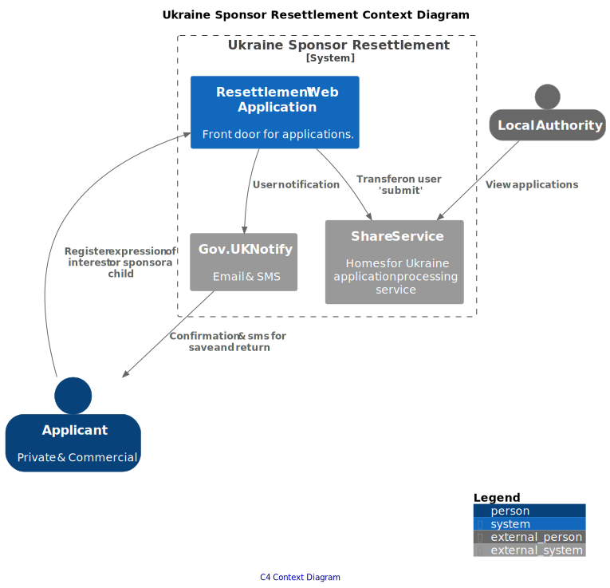
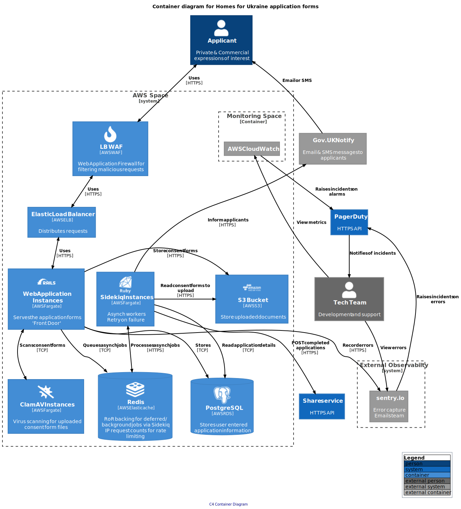

# Ukraine Sponsor Resettlement

This is the codebase for the [Ruby on Rails app](https://apply-to-offer-homes-for-ukraine.service.gov.uk/) that will handle the submission of sponsorship requests.

## Table of Contents

- [Deployment Pipeline](#deployment-pipeline)
- [System Context Diagram](#system-context-diagram)
- [Container Diagram](#container-diagram)
- [Component Diagram](#component-diagram)
- [Monitoring](#monitoring)
  - [Alerting](#alerting)
- [Related Repositories](#related-repositories)
- [Development](#development)
  - [Pre-requisites](#pre-requisites)
  - [Getting Started](#getting-started)
  - [Running Tests](#running-tests)
    - [Unit Tests](#unit-tests)
    - [Automated Tests (End to End)](#running-automated-tests-end-to-end-tests)
- [Database Migrations](#database-migrations)
- [Infrastructure](#infrastructure)

## Deployment Pipeline


## System Context Diagram

The, [C4 system context diagram](https://c4model.com/#SystemContextDiagram) is intended to show, at the highest level, the key users and interactions in the system.



## Container Diagram

The,  [C4 container diagram](https://https://c4model.com/#ContainerDiagram) is intended to zoom in from the system boundary, at the highest level, to provide further detail for the technical audience.



## Component Diagram

The, [C4 Component diagram](https://c4model.com/#ComponentDiagram) is intended to zoom in from the system boundary, at the highest level, to provide further detail for the technical audience.


## Monitoring

- [sentry.io](https://sentry.io/organizations/dluhc-ulss/projects/dluhc-ulss/?project=6260319)
- [CloudWatch](https://eu-west-2.console.aws.amazon.com/cloudwatch/home?region=eu-west-2#home:)
- [PagerDuty](https://madetech.eu.pagerduty.com/service-directory/PHFCTQM)

### Alerting

Alerts are configured in CloudWatch, and push to PagerDuty via a SNS topic. Sentry also creates incidents in PagerDuty on new errors.

PagerDuty incidents go to the #msp-live-service-alerts channel in Made Tech's Slack instance

## Development

### Pre-requisites

- Docker
- [asdf](https://asdf-vm.com/guide/getting-started.html)
- Ruby (recommend installing `rbenv` to install/manage the Ruby version)

### Getting started

#### First time

You may need to install some supporting packages (note the instructions from brew re adding them to your PATH):

```shell
brew install icu4c libpq
```

Install required runtimes, dependencies etc:

```shell
make prepare
```

#### Every time

#### Running locally

To run the web application natively outside of a docker container on your machine:

```shell
make run
```

This will automatically pick up any changes you make to the code, and is an easier development workflow for frequent changes.

The Rails server should start on <http://localhost:8080>

Either visit http://localhost:8080/sponsor-a-child/ or http://localhost:8080/expression-of-interest/

#### Running via Docker

To build and tag the web application image:

```shell
docker build . -t ukraine-sponsor-resettlement
```

To run the web application and all it's dependencies:

```shell
make run-webapp-docker
```

This is a more consistent running process with what the github actions pipelines run and what gets deployed to production,
but does not pick up code changes until you re-build the image and restart the webapp container.

You can also run the image from a remote ECR repo in AWS by first [authenticating docker against the remote repo](https://docs.aws.amazon.com/AmazonECR/latest/userguide/registry_auth.html#registry-auth-token) and then passing the image URI from ECR via the `WEBAPP_IMAGE` environment variable.

### Running tests

#### Unit tests

Run:

```shell
make test
```

NB: This builds a Docker image and sets up an environment for running tests depending on PostgresQL, Redis and S3.

The coverage report will be copied to `./coverage`.

#### Running Automated tests (End-to-End tests)

This repository features automated tests run using [Cypress](https://www.cypress.io/)

To run the cypress tests against a running instance of the web application:

```shell
make cypress-e2e-test
```

[Detailed end-to-end tests setup and instructions](automated_tests/README.md)

## Database migrations

Database migrations are required to make changes to the database

```shell
make db-migrate
```

Or to run the migrations against the web app running in docker:

```shell
make db-migrate-docker
```

This will create a file in the `./db/migrate` folder, and this file can be amended to reflect the change required.

## Infrastructure

This application is running on Amazon Web Services (https://aws.amazon.com/console/) via ECS on Fargate.

## Troubleshooting

### postgres errors during bundle install

If you have postgres installed separately (e.g. with `brew` on MacOS), when running 
`bundle install` you may see an error installing the `pg` gem:

```shell
ERROR:  Error installing pg:
ERROR: Failed to build gem native extension.

An error occurred while installing pg (1.5.9), and Bundler cannot continue.
```

Try installing the `pg` gem separately, pointing to the location of the `pg-config`:

```shell
gem install pg -v '1.5.9' -- --with-pg-config=$(brew --prefix libpq)/bin/pg_config
```

### ClamAV tests failing

There is a known issue where some laptops will block the EICAR file used to test the
ClamAV antivirus tooling.
